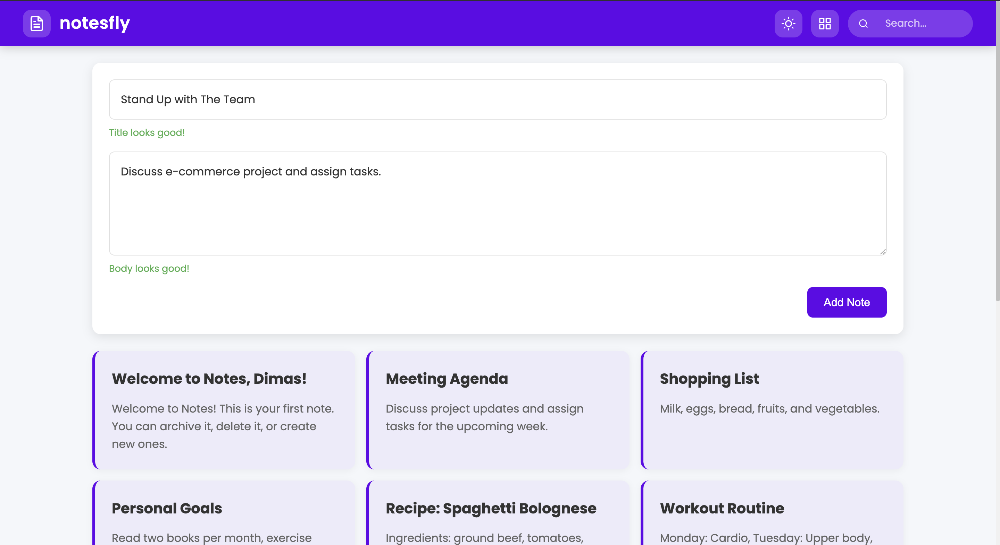

### Notes App (notesfly)

A modern, responsive note-taking web application built with vanilla JavaScript, HTML, and CSS. NotesApp allows users to create, search, and organize notes with a clean and intuitive interface.

## Features

- **Responsive Design**: Works seamlessly on desktop, tablet, and mobile devices
- **Dark/Light Mode**: Toggle between dark and light themes
- **Real-time Validation**: Form validation with instant feedback
- **Search Functionality**: **Quickly** find notes by title or content
- **View Toggles**: Switch between grid and list views
- **Persistent Storage**: Notes and preferences are saved to local storage
- **Mobile-friendly Navigation**: Hamburger menu for mobile devices

## Technologies Used

- HTML5 Custom Elements
- CSS3 with modern features (Grid, Flexbox, Variables)
- Vanilla JavaScript (ES6+)
- Local Storage API
- Responsive Design Principles

## Installation

1. Clone the repository:

```shellscript
git clone https://github.com/yourusername/notesfly.git
```

2. Navigate to the project directory:

```shellscript
cd notesfly
```

3. Open the project in your preferred code editor.
4. Launch the application using a local server or by opening `index.html` in your browser.

## Usage

### Creating Notes

1. Enter a title (minimum 3 characters)
2. Write your note content (minimum 10 characters)
3. Click "Add Note" to save

### Searching Notes

1. Use the search bar in the app bar to filter notes
2. Notes will be filtered in real-time as you type

### Changing Views

- Click the grid/list toggle button to switch between views

### Toggling Dark Mode

- Click the sun/moon icon to switch between light and dark themes

## Project Structure

```plaintext
notesfly/
├── index.html
├── src/
│   ├── scripts/
│   │   ├── component.js
│   │   └── app.js
│   └── styles/
│       └── style.css
└── images/
    └── app-icon.png
```

## Features in Detail

### Custom Web Components

The application uses custom web components for modularity and reusability:

- `<app-bar>`: Navigation and app controls
- `<note-form>`: Form for creating new notes
- `<note-list>`: Container for displaying notes
- `<note-item>`: Individual note display

### Real-time Form Validation

The form validation system provides immediate feedback:

- Title validation (3-50 characters)
- Body validation (10-500 characters)
- Visual indicators for valid/invalid states
- Descriptive error messages
- Submit button disabled until all fields are valid

### Responsive Design

The app adapts to different screen sizes:

- Desktop: Full navigation and multi-column note grid
- Tablet: Adjusted layout with two-column note grid
- Mobile: Hamburger menu navigation and single-column notes

### Theme Support

The application supports both light and dark themes:

- System preference detection
- Manual toggle option
- Persistent theme preference
- Smooth transition between themes

## Screenshots



## Future Improvements

- Note editing functionality
- Note deletion
- Categories/tags for notes
- Cloud synchronization
- Rich text formatting
- Attachments support
- Export/import functionality
- Collaborative notes

## Contributing

Contributions are welcome! Please feel free to submit a Pull Request.

1. Fork the repository
2. Create your feature branch (`git checkout -b feature/amazing-feature`)
3. Commit your changes (`git commit -m 'Add some amazing feature'`)
4. Push to the branch (`git push origin feature/amazing-feature`)
5. Open a Pull Request

## License

This project is licensed under the MIT License - see the LICENSE file for details.

## Acknowledgments

- Icons provided by [Lucide Icons](https://lucide.dev/)
- Font: Poppins from Google Fonts
- Inspiration from modern note-taking applications

---

_This project was created as a demonstration of vanilla JavaScript, HTML, and CSS capabilities without relying on frameworks or libraries._

> Built with love by [@sincanmaulanaa](https://github.com/sincanmaulanaa)
